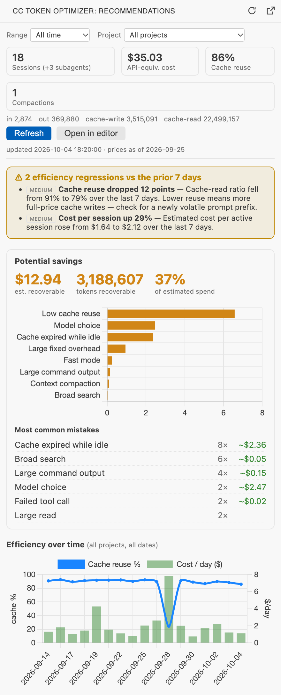
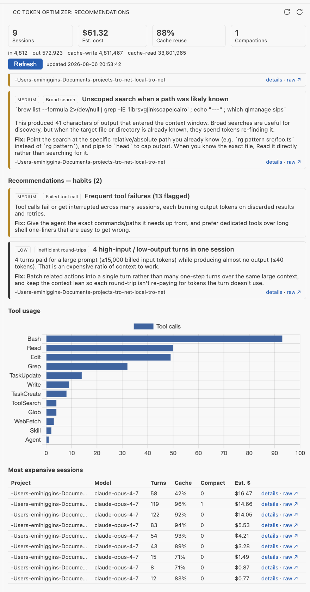

# Claude Code Token Optimizer

A VS Code extension that reads your local Claude Code session transcripts, analyzes token economics (usage, cache hits/misses, prompt length, context compaction, tool/search behavior), and surfaces **concrete recommendations** for reducing token spend and using the agent more efficiently.

Everything runs locally — it only reads the JSONL transcripts Claude Code already writes to `~/.claude/projects/`. No data leaves your machine, and nothing is sent to any service.

> v1 covers **Claude Code only**. GitHub Copilot's local session files don't record token counts (that data lives server-side), so Copilot analysis is intentionally out of scope for now.

## Screenshots

**Overview — potential savings, common mistakes, and efficiency over time:**



**Per-session recommendations, tool usage, and most expensive sessions:**



## What it detects

The recommendations engine flags, each from a real transcript trigger with an explicit token/cost estimate:

- **Context compactions** — each auto-compaction drops a large chunk of context (lossy) and re-primes a cold cache prefix. Reported per occurrence with the tokens dropped.
- **Context pressure** — a session whose peak prompt size reaches ≥80% of the model's context window is about to auto-compact; flagged as a preventive warning before it happens.
- **Broad / unscoped searches** — searches (Bash `grep`/`rg`/`find`, or the dedicated `Grep`/`Glob` tools) that dump large output into context, or that walk the whole tree with no path, glob, or file-type filter and return a meaningful amount of output. `… | grep x` filters and `xargs grep` over a narrowed file list are not counted as searches.
- **Large command output** — non-search Bash commands (`cat`, `git diff`, `git log`, verbose test runs) that dump output with no limiter (`head`/`tail`, `| grep`, `| jq`, `--stat`, `--oneline`, `-n N`, …).
- **Oversized / repeated reads** — the same file range read many times, or a single huge read where a line range would do. Paging through different ranges of one file isn't counted as repetition.
- **Read after write** — reading a whole file back right after Writing it, with nothing in between that could have changed it. (Reads after an Edit aren't flagged: an Edit only returns a snippet.)
- **Redundant commands** — the exact same read-only inspection command (grep/cat/ls/`git status|log|diff`) re-run in a session (test/build re-runs are deliberately not flagged).
- **Failed / interrupted tool calls** — errored or interrupted calls whose output was billed and then discarded (usually followed by a retry that pays again).
- **Low cache reuse** — sessions that write a lot of cache but read little back, the signature of a volatile prompt prefix invalidating the cache (writes cost 1.25×–2× input; reads cost ~0.1×).
- **Inefficient round-trips** — repeated turns with a large prompt but tiny output.
- **Cache expired while idle** — a pause longer than the cache lifetime (5 minutes, or 1 hour on 1-hour-TTL writes), after which the next turn re-wrote the whole context instead of reading it back. Priced as the write premium over a read.
- **Large fixed overhead** — a project whose sessions typically start with ≥45k tokens before any work (system prompt + tool/MCP definitions + CLAUDE.md), with the excess re-sent on every turn.
- **Model choice** — recent sessions on an older, pricier Opus once Opus 5.5 is in use, and short sessions run on Fable that a cheaper model would handle. Reported as the saving at Opus 5.5 rates.
- **Fast mode** — the premium paid for fast-mode turns over standard speed (informational).

Token estimates for tool output are **calibrated per session** from how much each tool result actually grew the next prompt (typically ~2–3 characters per token on current models, rather than a fixed 4). Sessions too short to calibrate use the median of your other sessions.

Findings are split into **one-off fixes** (specific to a session) and **habits** (patterns worth changing across sessions), then grouped by mistake category into collapsible sections ordered by recoverable cost. Any finding can be **snoozed** for 7 days or **dismissed**; hidden findings drop out of the savings totals and can be restored in one click.

### Filters, names, and layout

- **Range** (today / 7 / 30 days / all time) and **project** filters at the top of the view. In a new workspace the project filter starts on the project whose sessions ran in that folder.
- Projects show their folder name instead of the encoded directory, sessions show Claude Code's generated title, and models show short names (*Opus 5.5*).
- Subagent transcripts (`<session>/subagents/`) are included and badged.
- **Open in editor** (or the view's title-bar button) opens the dashboard as a full-width editor tab.
- Charts use the active theme's colors; every control is a keyboard-reachable button.
- Live updates keep your scroll position and don't interrupt an open drill-down, and a hidden view catches up when it's shown again.

### Potential savings dashboard

At the top of the view, a **Potential savings** panel shows the estimated recoverable dollars and tokens, the share of total spend that is recoverable waste, a bar chart of recoverable cost by mistake category, and a **most common mistakes** ranking (by frequency). Below it: token totals, API-equivalent cost, cache-reuse %, tool-usage chart, and your most expensive sessions. A status-bar item shows how full the most recent session's context is and its cost so far, and turns into a warning near auto-compaction.

### Trends & regression alerts

The extension tracks a daily efficiency series (cache-reuse %, cost/day, compactions, active sessions) derived from your transcripts and persisted to VS Code's global storage, so history survives restarts and outlives transcript pruning. An **Efficiency over time** chart plots cache-reuse % against cost/day, and a **regression banner** appears when the most recent 7 days degrade versus the prior 7 — a cache-reuse drop, a cost-per-session rise, or more sessions compacting. Regressions also raise a warning badge on the status-bar item.

To avoid false alarms, regressions only fire when **both** comparison windows have enough data (≥3 active sessions and ≥20k tokens each); sparse or gappy history produces the chart but no alerts.

### Per-session drill-down

Click **Details** on any row in the *most expensive sessions* table (or on any finding) to open a drill-down for that one session — parsed on demand, so the main payload stays small. It shows a **tokens-per-turn** stacked bar chart (input / output / cache-read / cache-write) with compaction points marked, a **compaction-events** list, and the **most expensive tool calls** ranked by token footprint with their exact target (the command, or the file path) and error/interrupt badges. This is the "where did this $175 session actually go?" view — it typically points straight at a handful of oversized reads or searches.

> The numbers are honest: on an already-efficient setup (high cache-read ratio), recoverable waste can legitimately be a small fraction of spend even when the behavioral patterns (broad searches, repeated reads) are worth changing.

## Cost model

Costs are **estimates** (Claude Code's local stats report `costUSD: 0`) at first-party API rates, priced per turn at the model that turn used — e.g. per 1M tokens, Opus 5.5 $4/$20, Sonnet 5.5 $2/$10, Fable 5.1 $10/$50, Haiku 4.5 $1/$5. Cache reads use each model's own price (0.1× input on most models, lower on Fable 5.1 and Opus 5.5); cache writes bill at 1.25× (5-min TTL) / 2× (1-hour TTL); fast-mode turns bill at fast-mode rates. If you're on a Pro/Max subscription, read these as API-equivalent cost. The full table, with the date it was last checked, is in `src/pricing.ts`.

## Install

**From the VS Code Marketplace** (recommended):

Search for **Claude Code Token Optimizer** in the Extensions view, or install from the [Marketplace listing](https://marketplace.visualstudio.com/items?itemName=side-quests.claude-code-token-optimizer).

**From source:**

```bash
npm install
npm run package     # produces claude-code-token-optimizer.vsix
code --install-extension claude-code-token-optimizer.vsix
```

Reload VS Code and open the **CC Token Optimizer** view in the Activity Bar. (You can also install a `.vsix` via the Extensions view → "…" menu → *Install from VSIX…*.) The `.vsix` is self-contained — `chokidar` and Chart.js are bundled at build time, so no runtime `node_modules` ship with it.

## Develop / run

```bash
npm install
npm run build       # bundles the extension host + webview (esbuild)
npm test            # typecheck + unit tests (88 tests across parser/model/pricing/rules/trends/detail/discovery/service/names)
npm run package     # build a .vsix (runs the minified prepublish build)
```

Press **F5** in VS Code to launch the Extension Development Host, then open the **CC Token Optimizer** view in the Activity Bar. The dashboard populates from `~/.claude/projects/` and refreshes automatically as Claude Code appends to transcripts.

## Settings

- `ccOptimizer.claudeHome` — override the Claude home directory (defaults to `~/.claude`).
- `ccOptimizer.largeSearchOutputBytes` — output size (chars) above which a search is flagged as large (default 20000).
- `ccOptimizer.lowCacheRatioThreshold` — cache-read ratio below which a session is flagged (default 0.8; healthy sessions usually reuse 90%+).

## Architecture

```
src/
  parser.ts       streaming JSONL reader + typed line schema
  model.ts        folds lines into a SessionModel (usage, tools, compactions)
  discovery.ts    locate ~/.claude/projects, enumerate + load transcripts (incl. subagents), mtime cache
  pricing.ts      model-id -> rates, cost estimation
  aggregates.ts   cross-session/per-session dashboard metrics
  rules/          recommendation engine (one file per rule, 14 rules)
  names.ts        readable model / project labels (shared with the webview)
  savings.ts      rolls findings into recoverable tokens/$ by category
  trends.ts       daily efficiency series + windowed regression detection
  trendStore.ts   persists the daily series in globalState (durable history)
  detail.ts       per-session drill-down (turn timeline, top tools, compactions)
  service.ts      analyze() (filters, dismissals) + loadSessionDetail() (one session)
  watcher.ts      chokidar watch on the Claude home (outside the workspace)
  statusBar.ts    live status-bar item
  webview/        sidebar view + editor panel, bundled Chart.js dashboard
```

The data layer (`parser`/`model`/`pricing`/`aggregates`/`rules`/`discovery`/`service`) has no `vscode` dependency and is unit-tested against fixtures and a temp `~/.claude` tree.
